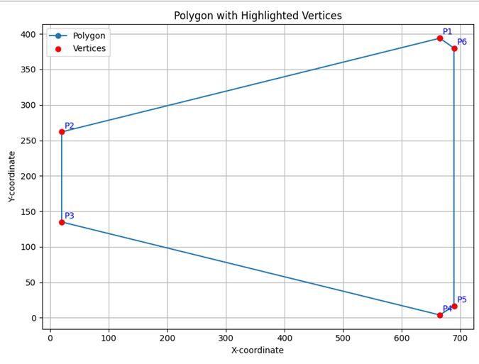

# Report

For the exam in the doctoral course *Multi-platform Programming for Research-Oriented Software*, it was decided to create a C library for analyzing moments of inertia. Specifically, the library references a woodworking machine capable of securing a wooden element to a workbench using special square-shaped suction cups.

Moments of inertia help determine the force required to tip the piece over, which is crucial as the goal during machining is to keep the workpiece as stable as possible. To achieve this, suction cups must be arranged so that the total moments of inertia (considering both the wooden piece and the suction cups) are maximized.

The C library is then accessed through Python. For this purpose, bindings were tested using both the `ctypes` and `cffi` libraries.

## Library Description

The C library is located in the _/native_ directory, containing the files `library.c` and `library.h`.

The `.h` files provide an overview of the methods and structures used by the library.

Three main structures were employed:

- **`Point`**: represents a point in the Cartesian plane with `x` and `y` coordinates.
- **`InertiaMoments`**: represents the moments of inertia calculated for a specific geometry, consisting of three values: `i`, `j`, and `ij`.
- **`Polygon`**: this structure encapsulates data related to the suction cups, such as their area, centroid, absolute moments of inertia, and rotation angle (if any).

The library provides the following methods:

- `get_polygon_area`: calculates the area of a polygon using the formula:

    $ Z_i = x_i y_{i-1} - x_{i-1} y_i $

    $ A = \frac{1}{2} \sum_{i=1}^{n} Z_i $

    where:
    - $A$: Area of the polygon
    - $Z_i$: Determinant for each pair of consecutive vertices
    - $x_i, y_i$: Coordinates of the polygon's vertices
    - $n$: Number of vertices

- `get_absolute_moments_of_inertia`: calculates the absolute moments of inertia of a polygon, which depend on its geometry and position in the plane. The formula is:

    $ J_{xi} = \frac{1}{12} \sum_{i=1}^{n} \left( y_i^2 + y_i y_{i+1} + y_{i+1}^2 \right) \left( x_i y_{i+1} - x_{i+1} y_i \right) $

    $ J_{yi} = \frac{1}{12} \sum_{i=1}^{n} \left( x_i^2 + x_i x_{i+1} + x_{i+1}^2 \right) \left( x_i y_{i+1} - x_{i+1} y_i \right) $

    $ J_{xyi} = \frac{1}{24} \sum_{i=1}^{n} \left( x_i y_{i+1} + 2 x_i y_i + 2 x_{i+1} y_{i+1} + x_{i+1} y_i \right) \left( x_i y_{i+1} - x_{i+1} y_i \right) $

- `get_baricentric_moments_of_inertia`: calculates the barycentric moments of inertia of a polygon, which depend solely on its geometry. For polygons with identical features, these values are identical. The formula is:

    $ J_{xgi}' = J_{xi} - y_{gi}^2 A_i $

    $ J_{ygi}' = J_{yi} - x_{gi}^2 A_i $

    $ J_{xygi}' = J_{xyi} - y_{gi} x_{gi} A_i $

    where:
    - $A_i$: area of the polygon
    - $(x_{gi}, y_{gi})$: coordinates of its centroid
    - $J_{xi}, J_{yi}, J_{xyi}$: moments of inertia relative to an absolute reference system (x, y)

    Considering the polygon's rotation angle $\alpha$, the overall solution becomes:

    $ J_{xgi} = J_{xgi}' \cos^2(\alpha) + J_{ygi}' \sin^2(\alpha) - J_{xygi}' 2 \sin(\alpha) \cos(\alpha) $

    $ J_{ygi} = J_{xgi}' \sin^2(\alpha) + J_{ygi}' \cos^2(\alpha) - J_{xygi}' 2 \sin(\alpha) \cos(\alpha) $

    $ J_{xygi} = (J_{xgi}' - J_{ygi}') \sin(\alpha) \cos(\alpha) + J_{xygi}' (\cos^2(\alpha) - \sin^2(\alpha)) $

- `get_overall_center_of_gravity`: determines the overall centroid of a set of geometries, given their areas, relative to an absolute reference system (x, y):

    $ X_G = \frac{\sum_{i=1}^{n} A_i x_{gi}}{\sum_{i=1}^{n} A_i} $

    $ Y_G = \frac{\sum_{i=1}^{n} A_i y_{gi}}{\sum_{i=1}^{n} A_i} $

- `get_combined_absolute_moment_of_inertia`: calculates the absolute moments of inertia of a set of geometries, given their barycentric moments of inertia:

    $ J_x = \sum_{i=1}^{n} J_{xi} $

    $ J_y = \sum_{i=1}^{n} J_{yi} $

    $ J_{xy} = \sum_{i=1}^{n} J_{xyi} $

    where:
    - $d_{ix}, d_{iy}$: distances in $x$ and $y$ between the centroid of each suction area $i$ and the overall center of gravity $G$

- `get_combined_baricentric_moments_of_inertia`: calculates the principal moments of inertia for a set of geometries, given their areas and centroid positions:

    $ J_{xg}' = J_x - y_g^2 A $

    $ J_{yg}' = J_y - x_g^2 A $

    $ J_{xyg}' = J_{xy} - y_g x_g A $

    $ J_{\xi} = \frac{(J_{xg}' + J_{yg}') - \sqrt{(J_{xg}' - J_{yg}')^2 + 4 J_{xyg}'^2}}{2} $

    $ J_{\eta} = \frac{(J_{xg}' + J_{yg}') + \sqrt{(J_{xg}' - J_{yg}')^2 + 4 J_{xyg}'^2}}{2} $

## Python Binding

To test the Python binding, two test files were written: `ctypes_test.py` and `cffi_test.py`.

Specifically, an example was created referencing a step of a spiral staircase to be outlined. The step is represented as a polygon with six vertices, as shown in the figure:



The piece can be supported by two square suction cups of size 145x145, as shown in the following figure:


### Ctypes

Using the `ctypes` library, once the vertices of the step and suction cups and their respective centers are defined, we can call the methods of the C library to determine the moments of inertia.

To use the library with `ctypes`, it is necessary to define the types of method arguments and the data type returned as a result. If the methods use structures, they must be declared as Python classes with their fields specified, as shown in the following code:

```python
class Point(ctypes.Structure):
    _fields_ = [("x", ctypes.c_double), ("y", ctypes.c_double)]
    
class InertiaMoments(ctypes.Structure):
    _fields_ = [("i", ctypes.c_double), ("j", ctypes.c_double), ("ij", ctypes.c_double)]
    
class Polygon(ctypes.Structure):
    _fields_ = [("area", ctypes.c_double), ("barycenter", Point), ("absolute_moments_of_inertia", InertiaMoments), ("angle", ctypes.c_double)]
```

Additionally, when using `ctypes`, special care must be taken with methods that require pointers. These must be specified using the `ctypes.POINTER()` function provided by the library when declaring the parameter types and the return type of the method.

```python
lib.get_polygon_area.argtypes = [ctypes.POINTER(Point), ctypes.c_int]
lib.get_polygon_area.restype = ctypes.c_double
```

### CFFI

Compared to `ctypes`, `cffi` simplifies the use of C libraries. In this case, it is not necessary to declare classes for structures or define the return types of methods; this is managed automatically by the library. However, when invoking a method declared in another language, the method elements must be instantiated using the library with a specific syntax, as shown in the following code:

```python
cup = ffi.new("Polygon*", {
    "area": area_square_cup,
    "barycenter": {"x": center_x, "y": center_y},
    "absolute_moments_of_inertia": absolute_moments,
    "angle": 0.0
})

baricentric_moments = lib.get_baricentric_moments_of_inertia(cup)
```

In conclusion, it was noted that using the `cffi` library is more convenient than `ctypes` and advantageous when there are many functions to call, as `cffi` does not require declaring method arguments and return types in Python. However, if the library to be used is small and immediate feedback on its usage is desired, `ctypes` proves to be a valid alternative.
